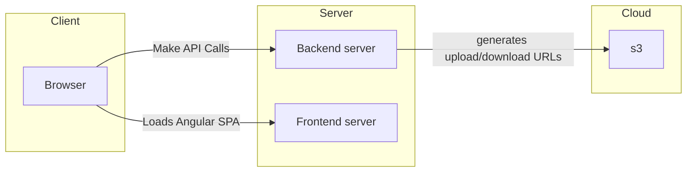

# Michelin

## Architecture



## Requirements

- Java 17 or later
- A Postgres Database

## Dev / Local

```mvn spring-boot:run```

## Build

```mvn package```

Generates a jar file at ```target/michelin-back-0.0.1-SNAPSHOT.jar```

## Environment variabvles

see ```src/main/resources/application.properties```
